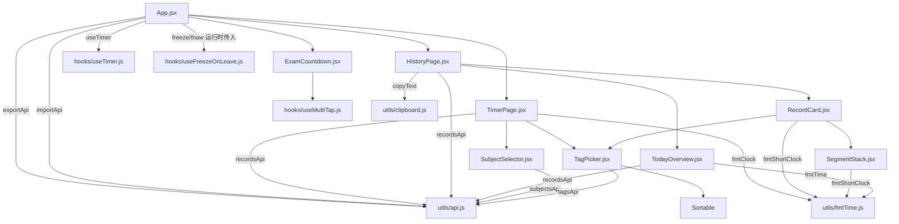

# FOCUS 客户端代码结构关系

> 当前版本：v0.4.1（结构变动见 [adr/0001-v0.4.1-code-structure-changes.md](adr/0001-v0.4.1-code-structure-changes.md)）

## 源码依赖图

箭头表示 import 方向，边上标注使用的导出符号：

> 说明：`useFreezeOnLeave` 不 import `useTimer`，通过 App 层把 timer 的 freeze/thaw 作为参数传入（运行时依赖）；`useTimer`/`useMultiTap`/`utils/*` 不 import 任何项目内模块。

## 文件职责与状态归属

| 文件                             | 职责                                                                               | 持有状态                                                                                                       |
| -------------------------------- | ---------------------------------------------------------------------------------- | -------------------------------------------------------------------------------------------------------------- |
| `App.jsx`                        | 主布局 + 底部导航 + 计时状态托管（useTimer）+ 全局管理模式 state/横幅（含「导出数据」按钮导出中/失败提示、「导入数据」按钮文件解析/确认弹窗/备份下载/导入中/整页刷新） | 是（timer、adminMode、exporting、importing、importPreview）                                                                              |
| `components/TimerPage.jsx`       | 计时器 5 状态机渲染（idle→studying→paused→rest_prompt→resting）+ 保存学习/休息记录 | 是（saving/toast/结束确认弹窗）                                                                                |
| `components/HistoryPage.jsx`     | 历史记录页面：日期导航 + 列表加载 + 全部编辑/删除/复制/筛选逻辑                    | 是（9 个编辑状态：editingId/draft/draftTags/draftPages/savingId/editError/copyFeedback/deleteError/filterTag） |
| `components/RecordCard.jsx`      | 单条记录卡片渲染（查看态 + ✏️ 编辑态表单 + 删除按钮 + 千层饼 + 时间戳）            | 否（纯展示壳，所有状态与回调由 HistoryPage 通过 props 传入）                                                   |
| `components/SegmentStack.jsx`    | 千层饼堆叠条（学习/暂停段按时间比例显示 + 总计/含暂停汇总）                        | 否                                                                                                             |
| `components/TodayOverview.jsx`   | 今日概览（总时长 + 科目条形图 + 标签分组 + 页数）                                  | 否（records 由 props 传入，自取 /today 聚合）                                                                  |
| `components/SubjectSelector.jsx` | 科目选择（固定列表 + 自定义 + 休息）                                               | 是（自身 CRUD 表单态）                                                                                         |
| `components/TagPicker.jsx`       | 标签选择器（点选/新增/删除/拖拽排序）                                              | 是（标签库 + 排序模式）                                                                                        |
| `components/ExamCountdown.jsx`   | 考研倒计时 + 全局管理模式隐藏入口（连点 5 下）                                     | 否（数据写死）                                                                                                 |
| `hooks/useTimer.js`              | 计时状态机 + freeze/thaw 冻结机制                                                  | 是（计时核心）                                                                                                 |
| `hooks/useFreezeOnLeave.js`      | 页面离开自动冻结                                                                   | 否（调用传入的 freeze/thaw）                                                                                   |
| `hooks/useMultiTap.js`           | 连点检测                                                                           | 否                                                                                                             |
| `utils/api.js`                   | fetch 封装（recordsApi / subjectsApi / tagsApi / remindersApi / exportApi / importApi）             | 否                                                                                                             |
| `utils/clipboard.js`             | 剪贴板复制（navigator.clipboard + execCommand 降级）                               | 否                                                                                                             |
| `utils/fmtTime.js`               | 时长格式化纯函数（fmtTime / fmtClock / fmtShortClock）                             | 否                                                                                                             |

## 格式化函数分工（utils/fmtTime.js）

| 函数            | 格式                                | 使用方                                          |
| --------------- | ----------------------------------- | ----------------------------------------------- |
| `fmtTime`       | 中文「1小时30分」                   | TodayOverview（概览汇总）                       |
| `fmtClock`      | HH:MM:SS / MM:SS（≥1 小时带小时位） | TimerPage（计时显示 + 休息 toast）              |
| `fmtShortClock` | MM:SS（分钟不折叠，如 75:00）       | RecordCard（时长）、SegmentStack（段时长/汇总） |

## 测试文件对应关系

| 测试文件                              | 被测单元                                                                | 层级                   |
| ------------------------------------- | ----------------------------------------------------------------------- | ---------------------- |
| `App.test.jsx`                        | App 布局与 Tab 切换 + 管理模式 + 数据导出 + 数据导入                              | 集成                   |
| `components/TimerPage.test.jsx`       | TimerPage 5 态 + 保存/休息/暂停/冻结 UI                                 | 组件                   |
| `components/HistoryPage.test.jsx`     | HistoryPage 页面级逻辑（加载/日期导航/编辑流/复制/筛选/删除 confirm）   | 组件（页面）           |
| `components/RecordCard.test.jsx`      | RecordCard 查看态/编辑态渲染 + 回调转发 + 千层饼显示条件 + 管理模式按钮 | 组件（卡片直测 props） |
| `components/SegmentStack.test.jsx`    | 千层饼段行渲染/顺序/汇总                                                | 组件                   |
| `components/TodayOverview.test.jsx`   | 今日概览 + 条形图                                                       | 组件                   |
| `components/SubjectSelector.test.jsx` | 科目 CRUD + confirm + 休息                                              | 组件                   |
| `components/TagPicker.test.jsx`       | 标签选择器                                                              | 组件                   |
| `components/ExamCountdown.test.jsx`   | 考研倒计时                                                              | 组件                   |
| `hooks/useTimer.test.js`              | 计时状态机全路径                                                        | 单元                   |
| `hooks/useFreezeOnLeave.test.js`      | 页面离开冻结事件                                                        | 单元                   |
| `hooks/useMultiTap.test.js`           | 连点检测                                                                | 单元                   |
| `utils/api.test.js`                   | fetch 封装（含 exportApi / importApi）                                    | 单元                   |
| `utils/clipboard.test.js`             | 剪贴板工具                                                              | 单元                   |
| `utils/fmtTime.test.js`               | 三个格式化函数                                                          | 单元                   |

> 测试依赖：所有组件测试通过 `vi.mock('../utils/api')` 拦截 API 调用；RecordCard/SegmentStack 直测时由调用方传入 mock 回调。
