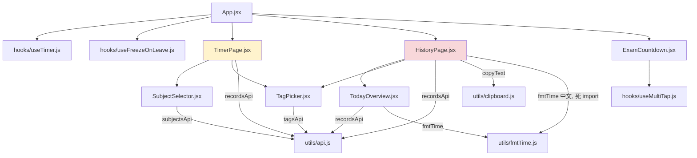
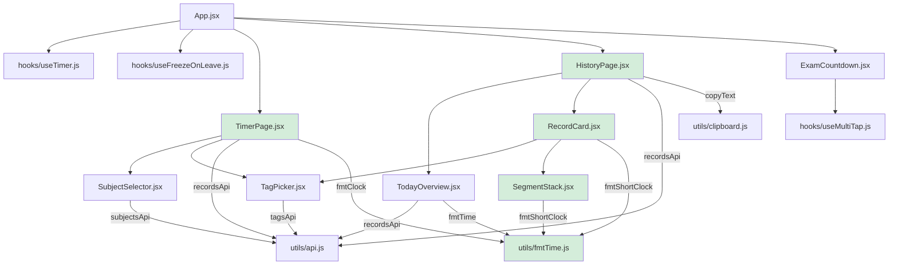

# 0001 · v0.4.1 代码结构改动说明

> 记录 HistoryPage 拆分重构的结构变化（改动前 v0.4.0 → 改动后 v0.4.1）。
> 当前结构总览见 [../CODE_STRUCTURE.md](../CODE_STRUCTURE.md)。

## 改动概览

- **新增**：`components/RecordCard.jsx`（记录卡片）、`components/SegmentStack.jsx`（千层饼）
- **修改**：`components/HistoryPage.jsx`（567 → ~330 行）、`components/TimerPage.jsx`、`utils/fmtTime.js`
- **删除**：HistoryPage/TimerPage 内的本地格式化函数与内嵌组件定义
- **原则**：纯搬家，功能与原样完全一致（所有状态归属不变，仅移动渲染代码）

## 改动前依赖图（v0.4.0）

> v0.4.0 的两个大文件内嵌内容：
> - **TimerPage.jsx**（黄色）：自带 `fmtTime` 函数（HH:MM:SS），与 utils 无关联
> - **HistoryPage.jsx**（红色）：自带 `fmtShortTime` 函数 + `SegmentStack` 组件 + 约 130 行记录卡片 JSX（查看态 + 编辑态 + 删除按钮）；`TagPicker` 仅在卡片编辑态内使用；`fmtTime` 中文版为死 import

## 改动后依赖图（v0.4.1）

## 文件直接关系映射（旧 → 新）

| 内容 | 改动前位置 | 改动后位置 | 方式 |
| --- | --- | --- | --- |
| 记录卡片 JSX（查看态 + 编辑态 + 删除按钮 + 千层饼 + 时间戳） | `HistoryPage.jsx` 内联（map 内） | `components/RecordCard.jsx` | 原样搬出，状态引用改 props |
| 千层饼组件（段行/汇总/含暂停） | `HistoryPage.jsx` 底部 `SegmentStack` 函数 | `components/SegmentStack.jsx` | 原样搬出为独立文件 |
| 短时长格式化（MM:SS） | `HistoryPage.jsx` 本地 `fmtShortTime` 函数 | `utils/fmtTime.js` 导出 `fmtShortClock` | 原样搬出 + 改名避免与中文 `fmtTime` 冲突 |
| 时钟时长格式化（HH:MM:SS） | `TimerPage.jsx` 本地 `fmtTime` 函数 | `utils/fmtTime.js` 导出 `fmtClock` | 原样搬出 + 改名 |
| 中文时长格式化 | `utils/fmtTime.js` 已有 `fmtTime` | 不动 | — |
| HistoryPage 对 TagPicker 的依赖 | 直接 import（卡片编辑态内使用） | 经 RecordCard 间接依赖（RecordCard 内 import） | 依赖下沉一层 |
| HistoryPage 对 fmtTime 中文版的 import | 死 import（文件内无调用） | 删除 | 清理 |

## 行为不变保证

1. **纯搬家**：所有搬出的 JSX 与函数逻辑原样复制，仅替换引用方式（状态引用 → props，函数调用 → import）
2. **状态归属不变**：editingId/draft/draftTags/draftPages/savingId/editError/copyFeedback/deleteError/filterTag 仍全部由 HistoryPage 持有；单条互斥、日期切换重置、保存失败保持草稿等行为与 v0.4.0 完全一致
3. **展示格式不变**：计时页仍 HH:MM:SS（`fmtClock`）、历史页仍 MM:SS 分钟不折叠（`fmtShortClock`）、概览仍中文时长（`fmtTime`）
4. **接口变化是唯一代价**：RecordCard 为纯展示壳，HistoryPage 通过 20 个 props 传入状态与回调——这是「行为完全一致」与「接口精简」取舍下的选择
5. **验证**：客户端 218 个测试全绿；原 HistoryPage.test.jsx 用例中 27 个保留在页面级、6 个转移至 RecordCard.test.jsx（千层饼显示条件/页数徽标/休息记录限制/管理模式按钮），另有 SegmentStack 5 个 + fmtTime 8 个新直测用例补充覆盖

## 测试文件迁移映射

| 原测试（HistoryPage.test.jsx） | 迁移去向 |
| --- | --- |
| 千层饼 4 个用例（显示/顺序/无 segments/单段） | SegmentStack.test.jsx（顺序/汇总/空）+ RecordCard.test.jsx（显示条件） |
| 页数徽标 2 个（显示/休息不显示） | RecordCard.test.jsx |
| 休息记录不显示标签 chips | RecordCard.test.jsx |
| 休息记录不显示备注编辑入口 | RecordCard.test.jsx |
| 管理模式删除按钮有无 2 个 | RecordCard.test.jsx |
| 其余 27 个（加载/日期导航/编辑流/复制/筛选/删除 confirm 等） | 保留 HistoryPage.test.jsx 原样 |
